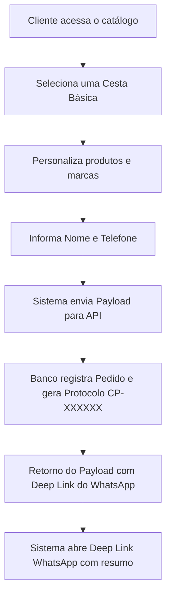
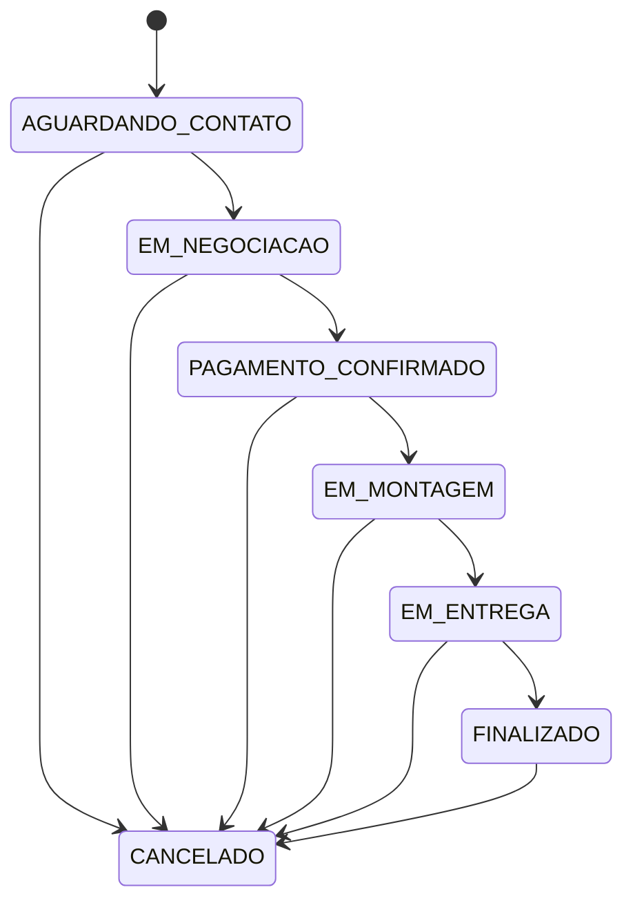

# Procedimento Operacional Padrão: Fluxo de Pedidos (order_flow_pop.md)

## 🎯 Objetivo
Padronizar o ciclo de vida de um pedido, desde a interação inicial do cliente no catálogo até a conclusão ou cancelamento da venda pela administradora.

---

## 🗺️ Ciclo de Vida do Pedido (Fluxo do Cliente)

O fluxo operacional do cliente segue as etapas sequenciais abaixo:

1. **Acesso**: O cliente entra na página inicial do catálogo.
2. **Seleção de Cesta**: Escolhe uma das cestas básicas oferecidas.
3. **Personalização**: Customiza as marcas e produtos permitidos dentro daquela cesta específica (substituindo itens por outros disponíveis em estoque).
4. **Dados do Cliente**: Preenche obrigatoriamente os campos **Nome** e **Telefone** na tela de finalização.
5. **Criação**: O sistema envia a requisição para a rota de API do Next.js.
6. **Persistência**: O banco grava os dados do cliente, gera o protocolo único sequencial (`CP-XXXXXX`) e define o status inicial como `AGUARDANDO_CONTATO`.
7. **WhatsApp Integration**: O sistema gera a URL do WhatsApp e redireciona o cliente instantaneamente via Deep Link para enviar a mensagem formatada para a atendente.

---

## 📈 Fluxo Oficial de Status dos Pedidos

O pedido deve seguir estritamente o fluxo linear definido abaixo, controlado e editado pela administradora no painel:

### Sequência Linear de Transições:
1. `AGUARDANDO_CONTATO` *(Estado inicial padrão)*
2. `EM_NEGOCIACAO`
3. `PAGAMENTO_CONFIRMADO` *(Status operacional - dedução de estoque)*
4. `EM_MONTAGEM` *(Status operacional - dedução de estoque)*
5. `EM_ENTREGA` *(Status operacional - dedução de estoque)*
6. `FINALIZADO` *(Status operacional - finalização completa)*

* **Exceção de Cancelamento**: O status de um pedido pode transitar diretamente para `CANCELADO` a partir de qualquer um dos estados acima.

---

## 📜 Histórico de Status Obrigatório
- Toda e qualquer transição de status deve gerar um registro físico automático na tabela `order_status_history`.
- Esta inserção é garantida por meio de um trigger no PostgreSQL (`trg_handle_order_status_change`), minimizando riscos de esquecimento ou falhas na camada da aplicação do frontend.
